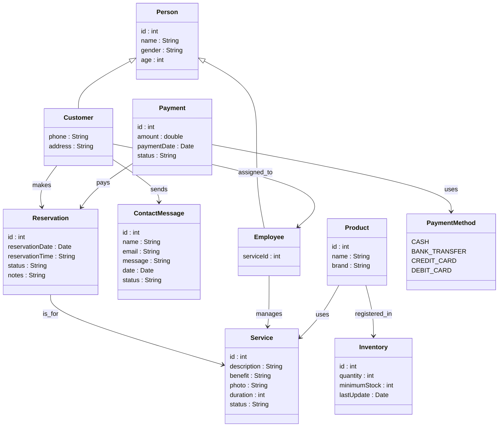

```mermaid
classDiagram

class Person {
    id : int
    name : String
    gender : String
    age : int
}

class Customer {
    phone : String
    address : String
}

class Employee {
    serviceId : int
}

class ContactMessage {
    id : int
    name : String
    email : String
    message : String
    date : Date
    status : String
}

class Reservation {
    id : int
    reservationDate : Date
    reservationTime : String
    status : String
    notes : String
}

class Payment {
    id : int
    amount : double
    paymentDate : Date
    status : String
}

class Service {
    id : int
    description : String
    benefit : String
    photo : String
    duration : int
    status : String
}

class Product {
    id : int
    name : String
    brand : String
}

class Inventory {
    id : int
    quantity : int
    minimumStock : int
    lastUpdate : Date
}

class PaymentMethod {
    CASH
    BANK_TRANSFER
    CREDIT_CARD
    DEBIT_CARD
}

Person <|-- Customer
Person <|-- Employee

Customer --> Reservation : makes
Reservation --> Service : is_for

Employee --> Service : manages
Customer --> Employee : assigned_to

Customer --> ContactMessage : sends

Payment --> PaymentMethod : uses
Payment --> Reservation : pays

Product --> Service : uses
Product --> Inventory : registered_in
```
